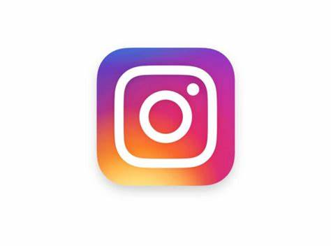

### Hi there 👋
#### I am ...

<!--
**venkata-pavani/venkata-pavani** is a ✨ _special_ ✨ repository because its `README.md` (this file) appears on your GitHub profile.

Here are some ideas to get you started:

- 🔭 I’m currently working on ...
- 🌱 I’m currently learning ...
- 👯 I’m looking to collaborate on ...
- 🤔 I’m looking for help with ...
- 💬 Ask me about ...
- 📫 How to reach me: ...
- 😄 Pronouns: ...
- ⚡ Fun fact: ...
-->

## 📈 GitHub Stats 

### 🤝 Connect with me:

 

<link href="https://cdnjs.cloudflare.com/ajax/libs/font-awesome/4.7.0/css/font-awesome.min.css" rel="stylesheet"/>

  <ul class="socialmediaicons">
    <li><a href="https://www.facebook.com/EnUnChasquido" target="_blank"><i class="fa 
fa-facebook"></i></a></li>
    <li><a href="https://www.instagram.com" target="_blank"><i class="fa fa-instagram"></i></a></li>
    <li><a href="https://www.twitter.com" target="_blank"><i class="fa fa-twitter"></i></a></li>
    <li><a href="https://www.youtube.com" target="_blank"><i class="fa fa-youtube"></i></li>
    </ul>
  

   

💬 If you have any question/feedback, please do not hesitate to reach out to me!
