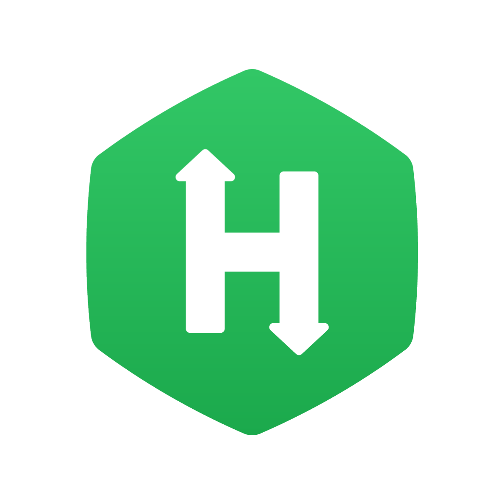

### Hi there 👋
#### I am ...

<!--**venkata-pavani/venkata-pavani** is a ✨ _special_ ✨ repository because its `README.md` (this file) appears on your GitHub profile. -->

## 📈 GitHub Stats 

<!--

-->

😄 Pronouns: She,Her(s)  
✨ About Me : Dealing with complex messy data ,self motivated to learn new technologies and try new solutions  
🌱 Learning is my passion. Learning how to Learn is the most important skill

## 🔭 I’m currently working on ..

◼️ Curating solutions to complex business problems.  
◼️ Working on innovative data-driven solutions to the customer driven organizations

## 👯 I’m looking to collaborate on ...

👀 I’m interested to collaborate in Software/Data Engineering projects in general. Reach out to me on my <a href="mailto:venkatapavani2017@gmail.com" target="_blank" rel="noopener">email</a>

## ⚡ In my free time ...

🧘 I volunteer,mentor and contribute to various activities/causes including Toastmasters  
✏️ I like to **Sketch** (check out my <a href="https://www.instagram.com/sketches_by_pavani/" target="_blank" rel="noopener noreferrer">Instagram</a>)  
📚 I enjoy **Reading** (check out my <a href="https://www.goodreads.com/user/show/66469057-pavani-nvl" target="_blank" rel="noopener noreferrer"> GoodReads Profile</a>)  
🎤 Singing & Carnatic Music is my passion
 

### 🤝 Connect with me:

<!--
 

-->

💬 If you have any question/feedback, please do not hesitate to reach out to me!
